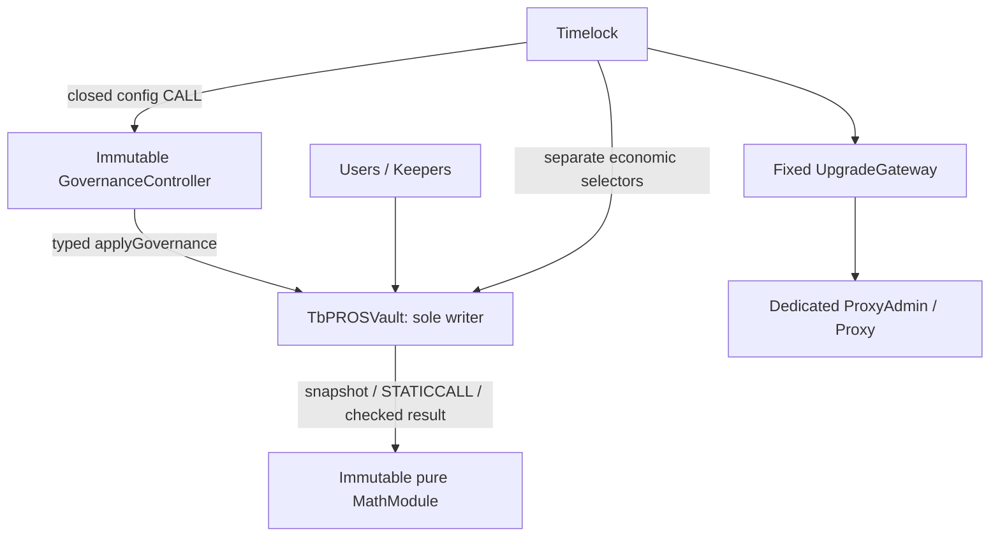

# 22 · STATICCALL Module Architecture + GovernanceController Feasibility Study

基于 `f3187659eb19a464abfc5bc93e15a3d4e73c7e2b`，2026-09-15。**仅架构可行性研究，不迁移production、不删除任何已批准V1功能**。

```text
STATICCALL MODULE SAVINGS INSUFFICIENT
SINGLE-VAULT FULL-V1 PATH REMAINS BLOCKED
NEW ARCHITECTURE DECISION REQUIRED
PRODUCTION NO-GO
```

最终回答：**NO — still not credible**。按当前冻结安全边界，纯计算外置后的统一模块只回收737 bytes，未达到组合1,500门槛；五setter→Controller反增215，八setter→Controller也仅回收68。包含计算与治理的完整配对probe仅回收290，Vault为27,301，超过20,480预算6,821。这里的27,301是**实际编译的架构probe**，不是完整V1最终bytecode，也不是任意实现的数学最小值。

## A. Problem

当前生产runtime **18,574 / 20,480**，headroom **1,906**。Request与objective Insolvency已IMPLEMENTED / VERIFIED；其余资金业务仍stub。完整USDC Subscription、E01、risk、两个Request、Settlement、Claim、plan/checkpoint、Fast、sync/restore、surplus、治理、Reserve/Gateway全部保留。本轮用户“不减少功能”取代21建议中的产品缩减方向；本页没有提议删Fast/Claim/Yield等。

按Hard Rules→00→16→18→19→20→21解释既有语义；14 APR及01/02/03/04、现有production源码、reference、ABI/storage/bytecode和本地摘要作为基线。所有probe固定solc **0.8.28+commit.7893614a / optimizer200 / viaIR=false / Cancun / OZ5.6.1**。

[工具](../../tools/tbpros/staticcall-architecture-study.py)从该git commit读取真实Vault源码，使用相同继承、dispatcher、local reentrancy、normalState及risk/权限边界；[模板](../../tools/tbpros/staticcall-study-templates.py)只生成ignored cache内的变异编译输入。没有用一个ToyVault的大小代表真实Vault。

实际数据见[37组机器证据](verification/staticcall-architecture-variants.json)，生产检查见[本地摘要](verification/latest-local-checks.md)。从仓库根目录复跑隔离编译及测试：

```sh
TBPROS_SOLC=/Users/wangningbo/Library/Caches/hardhat-nodejs/compilers-v3/macosx-amd64/solc-macosx-amd64-v0.8.28+commit.7893614a python3 tools/tbpros/staticcall-architecture-study.py --fresh
```

边界必须说清：六个`study*`入口从真实Vault state取snapshot，返回计算结果；没有USDC/Reserve资金流、share burn、Settlement队列推进、Claim支付、yield realization或plan lifecycle写入。原有这些业务stub仍在。治理对照则在隔离源码中替换五/八个setter为完整配置检查及写入；H对照只在隔离源码迁出计算。新增study入口带来的dispatcher/decoder成本不是未来产品必须原样保留的ABI，所以这些是**配对计算压力测量，不是完成产品或严格lower bound**。

## B. Security Boundary



这是受测拓扑，**未批准迁移**。所有计算模块external pure、无owner/admin/proxy、无可写账本、无资金托管、无外部调用或callback要求。只接收Vault传入的最小snapshot，不读取Vault getters，不读取Oracle/Reserve。

Solidity typed pure接口产生STATICCALL。compiler **runtime legacy assembly**证明模块没有CALL/STATICCALL/DELEGATECALL/SSTORE/TSTORE/SELFDESTRUCT；Vault没有新增DELEGATECALL，只有既有OZ Transparent proxy自身的标准delegatecall仍在trace中。547条带已标记Module地址的实际STATICCALL trace来自隔离Foundry执行；不能把proxy已有delegatecall误说成module delegatecall。

接口标准解码之后额外检查`returndatasize()`等于静态输出tuple的字节数。唯一相关assembly仅读取这个EVM长度，没有手工解析任意payload或不透明偏移；因此短返回、额外尾部、错误结果和revert都fail closed。只依靠typed decoder通常接受合法tuple后的额外数据，本probe没有把这种宽松解码冒称为exact-length validation。

## C. Single-writer Rule

| 内容 | 分类 | 最终归属 |
| --- | --- | --- |
| Settlement floor / U/B burn arithmetic | SAFE_STATICCALC | module可算；q/S/R/U/B snapshot、domain及所有burn/写入仍Vault |
| Claim累计floor差额 | SAFE_STATICCALC | module可算；Position、Epoch预算、count、dust及payment仍Vault |
| E01份额与余数 | SAFE_STATICCALC | actual receipt、positive shares、精确E01最终检查仍Vault |
| APR/USD/current validated price arithmetic | SAFE_STATICCALC | price获取/有效性、backlog、source足额、cursor写入仍Vault |
| Risk refill/carry/clip | SAFE_STATICCALC | 单一Bucket状态、old-term保守性、消费/配置最终写入仍Vault |
| Plan时间裁剪/预算加减 | SAFE_STATICCALC | activation/retirement、H分类/refund、source身份仍Vault |
| 命名治理API、类型/基本参数policy | SAFE_CONTROLLER_ORCHESTRATION | 固定Controller可编排，只能CALL closed applyGovernance |
| S/R/P/F/H/U/B/C、Epoch/Position/Plan/Bucket/Mode | MUST_REMAIN_IN_VAULT | Vault唯一writer，未创建第二份状态 |

SAFE是可讨论的安全职责边界，**不是经济等价已全面证明、也不是推荐采用**。Module的返回值没有独立债权地位；Controller不拥有任何claim state或协议资金。

## D. MathModule Designs

M1与M3如果都包含同一套纯函数，本质是同一种单地址设计。为提供有意义的实际对照，本研究定义：M1一个地址只外置Settlement/Claim/Mint，Yield/Risk/Plan继续本地；M3同一个地址外置六组。二/三/四模块覆盖同样六组；没有通过删掉某组功能来比较。

| Variant | Vault runtime | Module runtime(s) | Controller runtime | 对配对local节省 |
| --- | ---: | ---: | ---: | ---: |
| combined-local | 25,029 | — | — | — |
| M1-one-core-math | 24,853 | 2,577 | — | +176 |
| M3-unified | 24,292 | 4,616 | — | +737 |
| M2-2-modules | 24,554 | 2,577 + 2,691 | — | +475 |
| M2-3-modules | 24,803 | 2,577 + 1,231 + 1,885 | — | +226 |
| M2-4-modules | 25,028 | 1,726 + 1,394 + 1,231 + 1,885 | — | +1 |

模块分组：两个=Settlement/Claim/Mint + Yield/Risk/Plan；三个=Settlement/Claim/Mint + Yield + Risk/Plan；四个=Settlement/Claim + Mint + Yield + Risk/Plan。原H计算默认留Vault。

初始化一次写入固定地址，无runtime setter。在相同基线仅增加bindings/decoder、code/nonself检查及可解码的非零`moduleVersion()`：

| 固定module数 | initializer/binding control Vault runtime | 对18,574增加 |
| --- | ---: | ---: |
| 1 | 18,928 | 354 |
| 2 | 19,190 | 616 |
| 3 | 19,439 | 865 |
| 4 | 19,664 | 1,090 |

这是整份runtime中的初始化边际，不是假称精确可分离的decoder成本。StudyBindings作为新struct追加到Core的relative slot40，module数组每地址一槽；现有slot0..39及其packing不变。Controller若存储则位于该struct的module数组后；只有Controller时位于40。全部是probe schema，不改生产schema。

身份对照以Claim为背景：decode/nonzero 19,661；固定version匹配19,695（再加34）；初始化extcodehash pin19,810（在version之上再加115，总加149）。每次计算不再重复codehash检查，三者repeat call gas相同。code.length/nonself只能拒EOA/self，version/interface可被伪造；test中伪造version的恶意代码成功通过version-only初始化，但被实际编译模块runtime hash pin拒绝。**若迁移必须用已审代码身份作为信任锚，不能仅靠version宣称不可替换算法**。本轮hash是actual bytecode的keccak，不是让调用者同时给地址和“期待hash”。

## E. Settlement Probe

读取pre-burn真实S/U/B/R，输入q；要求S>0、0<q≤S：

```text
assets = floor(q*R/S)
du = q==S ? U : floor(q*U/S)
db = q==S ? B : floor(q*B/S)
```

local 19,609；STATICCALL 19,789，**没有回收，反增180 bytes**。Module1,091。Vault保留assets≤R、du≤U、db≤B；full burn要求三者精确清空对应snapshot量。部分burn的bounds不证明每个floor精确，依赖固定受审module算法。没有执行share burn或锁定Epoch；normal mode/backing/local lock保留。

## F. Claim Probe

真实Position.requested/claimed与Epoch.num/den/remaining入snapshot；要求settled、delta>0、old+delta≤requested。纯计算：

```text
newClaimed = old + delta
payout = floor(newClaimed*num/den) - floor(old*num/den)
```

local 19,446；STATICCALL 19,661，**反增215**；Module1,105。Vault检查newClaimed精确等于old+delta、≤requested、payout≤remaining；没有第二burn或第二份Claim权。

cheap invariant的限制有实际test：合法right old=3e18、delta=7e18、num/den=1000/1100，恶意module返回next=10e18、payout=1，仍满足bounds，调用被接受。这是明确的**信任边界反例**，不是宣称错误舍入被全部拒绝。固定module源码及codehash必须可信；否则可低付/错付，cheap bounds不能替代数学正确性。正向算法用独立Fraction vectors及累计floor telescoping参考验证。

## G. Subscription/E01 Probe

输入actual-assets形状的a、真实S/R及epsilon；仅数学probe，a由测试提供，未实现actual stPROS receipt measurement或入金路径。Module计算q=floor(aS/R)、m=mulmod(a,S,R)及ceil(10000m/(aS))≤epsilon。

Vault再次检查：q>0、q≤uint128.max−S、m等于实际mulmod、qR=aS−m、精确E01上界；S=0时要求R/U/B=0，q=a。输入a/S/R均uint128，所以aS、qR可安全放uint256；ceil使用OZ full-precision Math.mulDiv，不能用可能溢出的cross multiplication代替。

local 20,102；STATICCALL 20,255，**反增153**；Module1,394。为了强制actual E01、保护mint公平，Vault保留部分计算，这正是不能夸大可迁出体积的原因。恶意module返回看似合法的q−1但m不匹配，被独立关系检查拒绝。无USDC/Reserve/Oracle资金流。

## H. Yield Probe

按14冻结公式，APR恒500，不开放APR setter：

```text
N = Uraw6*1e12*500*elapsed + oldRemainder
usd = floor(N/(10000*YEAR)); newRemainder = N mod (10000*YEAR)
stPROS = floor(usd*1e36 / (priceWad*ratioWad))
```

U为uint128、elapsed/YEAR为uint64，N域有既有上界；两个正price input以uint128 WAD为study domain，product≤uint256，最后一次转换用Math.mulDiv，避免两个连续floor扩大误差。Vault保留mode/backing、matured queue barrier、carry范围、真实active-source预算与R溢出约束。没有实现cursor或H→R。

local 19,632；STATICCALL 19,878，**反增246**；Module1,231。valid price只作为参数传入；module不查询Oracle。需要特别区分：现有Adapter接口是`quoteYieldStPROS(usdWad)`，转换的一部分原本就在Adapter里；本probe按本轮要求把validated p/x arithmetic展示出来，**不表示已经批准更改Adapter接口，也不把Adapter里已有计算伪称为Vault可回收代码**。所以该probe是计算形状对照，不是现有oracle integration的替换实现。

## I. Risk Probe

使用old capacity/credit/rate/last/carry与now，materialize到now；先old-cap饱和，再new-cap clip，饱和清carry，最后扣consume。newRate只对未来有效，不能回算过去或在cap increase时补满credit。

local 19,990；STATICCALL 20,277，**反增287**；Module1,242。Vault独立算保守credit ceiling，要求consume可覆盖、returned credit=ceiling−consume、carry<1e18、last=now。gifted integer credit的恶意结果被拒；剩余carry是否精确仍依赖immutable算法。治理配置probe使用本地完整Calc.risk后由Vault写入，不能让Controller传一个任意新credit。

Plan仅测试frozen terms domain、时间clipping/elapsed及source总预算减amount，不定义未批准的来源收益分配政策；local19,736、static19,923，**反增187**，Module1,197。是否funded/active、何时refund、代次和每source writer仍是Vault职责。

## J. Combined Module

六组local一起进入真实Vault为 **25,029**；全部外置到单模块后 **24,292**，实际非加和回收 **737**；模块4,616，合并code surface28,908。M1只外置三组回收176。继续拆为2/3/4模块回收分别475/226/1，初始化与多地址校验吞掉收益。

737低于本轮组合1,500门槛，也没有单项达到750。不是“internal library拆文件就省体积”：Calc internal函数编译进Vault，外置后typed ABI编码、tuple复制/解码、exact return-size与final invariant仍留Vault。OZ Math.mulDiv原本也被既有HLoss及必须保留的E01检查共享，迁出一个调用不等于删除一整份Math实现。

H诊断：生产local baseline18,574；STATICCALL H后18,983，**反增409**，模块1,286。无输出检查的安全退化对照18,754仍反增180；完整cut≤remaining及sum=target校验的边际为 **229 bytes**，不得删除。source.remaining/realizedLoss仍由Vault写。probe把F扣减延后到module计算返回之后，避免静态read callback看到一半F变化；所有失败仍整笔回滚。already-mode sync仍在任何dependency之前return。**不迁移生产Insolvency**，其17,932既有差分不因这个研究变成“外置版本已全面验证”。

## K. GovernanceController

immutable timelock与fixed vault；无owner setter、proxy、任意execute、fallback router、delegatecall、资金托管或第二账本。Controller只提供已命名配置方法，并调用唯一typed applyGovernance。fundPlan/activate/close/schedulePenalty/syncSurplus仍是独立经济入口，由原TL权限/normal guard处理，不通过Controller配置route。

| Variant | Vault runtime | Module runtime(s) | Controller runtime | 对配对local节省 |
| --- | ---: | ---: | ---: | ---: |
| G5-local | 21,409 | — | — | — |
| G5-enum | 21,624 | — | 2260 | -215 |
| G8-local | 21,691 | — | — | — |
| G8-enum | 21,623 | — | 3223 | +68 |
| G8-batch | 22,065 | — | 4021 | -374 |
| G8-derived | 21,890 | — | 3223 | -199 |

五个完整窄setter→enum Controller **反增215**；扩到八个仅回收 **68**，远低于400门槛，不能借口“policy移走”跳过Vault核心检查。Controller本身增加2,260或3,223 bytes；batch Controller4,021。保留此前OZ AccessControl/ERC20，不以移除它们制造Controller收益。

fixed stored controller与从fixed Gateway getter派生实测：八kind存储21,623；派生21,890，**再增267**，还增加runtime STATICCALL/部署耦合。派生variant真的给Gateway增加immutable getter；其runtime为2900，测试部署其真实构造bytecode并用于读取，不用tx.origin或可变registry。推荐若未来另有采用理由优先一次存储的fixed binding；本轮两者均不推荐迁移。

## L. applyGovernance Design

Enum更新采用闭合8-kind：PrincipalCap、MintLossBound、FastFee、MaxPlanDuration、BucketConfig、Oracle、FoundationReceiver、YieldRefundReceiver。标准ABI enum解码拒绝≥8；五kind版本另要求<5。Update为kind/value0/value1/account，不是selector或arbitrary calldata：每kind只映射一段固定逻辑，unused字段拒绝。bucket用account字段的整数0/1编码固定slot，其他值拒绝；这是明确的probe DTO取舍，若未来采用应优先另审更直观的专用slot字段，不能当成任意recipient。

Batch为闭合mask 1..255加具名字段，unknown bit拒绝；固定顺序cap→mint bound→fee→duration→bucket→oracle→receivers。未选字段不执行也不解释；没有external funds call。测试第一项cap写入成功、后续fee超限导致整笔回滚，C恢复原值；state-change logs按EVM规则一起回滚。纯地址的code检查不是动态经济checkpoint。

Vault最终保留C≥B、epsilon只紧、fee≤initial hard max、duration>0、bucket旧terms保守materialization/no gift、oracle code/nonself+required risk pause、receiver排除零/self/两个Reserve。Controller自身类型/基本policy检查不代替任何这些条件。恶意Controller身份也无法用低cap/高fee/widened bound/zero duration/错receiver绕过；config kind没有mode-clear、H分类或epoch rewrite。

**SPEC / STUB GUARD DRIFT仅在probe解决**：五个纯配置在mode成功，无normalState/余额或Oracle价格前置；本地锁及TL/Controller鉴权保持。生产五个setter仍是原stub，不能把probe成功当成production已修复。Controller没有mode bypass：funding、plan转换、surplus、settlement/claim仍受原money guard。

权威事件由Vault发出，沿用现有`PrincipalCapChanged(old,new)`、`MintLossBoundTightened`、`FastFeeChanged`、`MaxPlanDurationChanged`、`BucketConfigChanged`及receiver/oracle事件。测试检查event emitter为Vault。Controller forwarding event不是必需，本probe未加入，不用它替代最终写入事件。

## M. STATICCALL Failure Model

[19项隔离Foundry测试](../../test/tbpros/staticcall-study/StaticcallStudy.t.sol)实际通过；独立[Fraction/integer reference](../../reference/staticcall_study_model.py)提供 **460组**七类向量，覆盖wide arithmetic、full burn、Claim分段、零/满H与tie、risk饱和/配置、APR carry。7个差分测试直接跑已编译module，另有真实Vault wrapper与恶意返回/Controller测试。不是完整资金stateful或upgrade replay。

| 场景 | 攻击前→调用→结果 |
| --- | --- |
| revert / short returndata | 已锁right→bad module revert或返1 byte→typed decode/调用失败，right/R/P/S快照不变 |
| oversize / max result | old3e18/requested100e18、budget100e18→返回max或payout101e18→RESULT拒绝 |
| wrong progress / trailing bytes | 正确next应10e18→返回11e18或多一个word→精确进度/RETURN_SIZE拒绝 |
| bounded wrong rounding | 返回next10e18,payout1→**可通过bounds**；必须依赖固定正确算法，不能宣称cheap checks证明全部结果 |
| wrong H sum / oversized cut | F10e18、实际D=10e18+3→返回sum1或cut>source→失败；F和H保持原值 |
| plausible incorrect mint | a10e18、S1100e18、R1000e18→q应11e18却返q−1/m0→独立qR/m/E01检查拒绝 |
| risk gift | old refill/clip/consume后应75→返76→保守ceiling检查拒绝 |
| callback | module在STATICCALL内尝试CALL Vault.transfer→本地nonReentrant拒绝；view callback mode()可读但不能写 |
| fixed-code spoof | 恶意代码返回正确version→version-only可能通过；expected runtime hash pin拒绝 |
| failed module with safe/no-op | 恶意module恒revert，mode=true→safe、transfer/from/approve、already-mode sync仍成功，不调用module |
| malicious Controller / batch | 非TL转发、非Controller apply、bad enum、核心参数越界、unknown mask→拒绝；部分batch写入回滚 |

cheap checks不能证明部分burn比例、所有yield换算、Claim舍入、H tie fairness或fractional risk carry。**Module是受信协议代码**，不是不可信结果只要bounds就能任意接受的Oracle。全部真实模块无callback；测试恶意module是为了刻画边界，不给生产module增加回调能力。

## N. Upgrade / Historical Rights

地址initial-only，无普通setter。bug或算法更换只能经原Multisig→Timelock→Gateway→专属ProxyAdmin→Vault upgrade，并通过新Vault代码中明确受审的一次迁移写入新binding。不能给Module/Controller加proxy、owner、setLogic或instant replacement；不能用再次initialize绕过初始化锁。

**历史Claim的累计floor差额永久冻结**；新模块必须继续同算法，不能将旧num/den或已claimed进度按新舍入解释。Plan的YEAR、APR carry单位/范围、价格规范化和fullburn隔离都必须语义兼容；H source ID/tie rule不可随版本改变。codehash相同可证明代码身份，不自动证明升级后的输入单位/调用顺序相同；仍需包含部分已领Position、未付P、active/next sources、旧carry的真实升级重放。

健康locked Claim/Settlement若外置，准确声明应是：**depends only on immutable deterministic protocol code modules for math, not Oracle/Reserve/Keeper**；仍依赖真实payout token、Vault/proxy与链执行，不能说“完全无外部合约依赖”。固定正确且无外调的module不会因市场价格/库存/keeper故障而失败，但错误部署、错hash/binding、算法bug或不兼容升级可能使退出一直revert。

这时没有permissionless替代算法或自动换地址；用户只能等待受审Timelock升级，无法给出无条件有界修复时限。保留本地fallback会重复算法、抵消bytecode目标；本研究未提出这种未测fallback。safe登记和普通ERC20仍完全本地，already-mode sync仍no-op，但它们不是付款保证。新增这种liveness耦合必须有足够体积收益，本轮没有。

## O. Runtime Results

| Variant | Vault runtime | Module runtime(s) | Controller runtime | 对配对local节省 |
| --- | ---: | ---: | ---: | ---: |
| A-baseline | 18,574 | — | — | — |
| combined-local | 25,029 | — | — | — |
| M3-unified | 24,292 | 4,616 | — | +737 |
| C-local-control | 27,591 | — | — | — |
| C-module-controller | 27,301 | 4,616 | 3223 | +290 |

Architecture A：生产当前18,574，完整V1仍blocked。Architecture B：六组计算pressure probe，最小单模块Vault24,292，Module4,616，仍超预算3,812。Architecture C：相同计算+八种配置，local对照27,591，module+Controller **27,301**，Module4,616，Controller3,223，combined measured surface **35,140**。

C只比完整配对local少 **290**，不是737+68=805；编译器共享/内联、final checks和不同入口布局使delta非加和。不能与18,574直接比较来声称“STATICCALL令生产增加8,727”，因为probe增加了尚未实现的计算/配置范围；也不能反过来删除那些scope只展示最小call wrapper节省。

所有模块低于本轮12KiB工程预算，Controller低于8KiB；原Vault20,480预算**没有提高**。超过20,480的probe在证据中明确`runtime_budget_status: FAIL`。若runtime超过链部署限制，测试仅用vm.etch安装于现有真实proxy implementation地址测行为/gas，**不是成功部署证据**，没有通过改chain/code-size-limit使其上线。创建的modules/Controller实际执行构造；完整部署/handoff仍未验证。

## P. Gas Results

计时围绕对真实OZ proxy的CALL，包含module交互、ABI、最终检查及返回。比较同一fixture的repeat路径，避免把首次冷暖差误当算法收益；不是Pharos receipt、cold transaction或deployment gas。146条样本完整在JSON。

| 运算 | local repeat gas | static repeat gas | 增加 |
| --- | ---: | ---: | ---: |
| settlement | 7,856 | 9,654 | +1,798 |
| claim | 8,091 | 10,004 | +1,913 |
| mint | 9,199 | 10,710 | +1,511 |
| yield | 8,561 | 10,288 | +1,727 |
| risk | 5,694 | 8,179 | +2,485 |
| plan | 8,628 | 11,242 | +2,614 |

H同一局部fixture序列：45,432→47,284，增加1,852；其读写路径与普通math wrapper不同，不外推成任意loss大小的最大gas。五setter治理repeat 4093→6018，八setter 4093→5951；batch 6693，派生Controller 6724。这些是cap配置样本，不能冒称所有policy操作gas。

DTO对照：Claim struct static19,661 / repeat10,004；六scalar19,728 / repeat9,918；标准ABI `bytes`封装三个uint256 packed words19,833 / repeat10,015。packed内仅对六个uint128做已知高低128位编码/解码，外层仍用abi.encode/abi.decode，不使用任意字节parser。其ABI动态偏移/长度成本比struct更大；只少86 gas的scalar也不能补偿runtime反增67。默认标准struct更易审阅，未声称packed bytes一定省空间。

## Q. Security Trade-offs

| 风险 | 架构约束及尚存风险 |
| --- | --- |
| code substitution / deployment error | immutable nonproxy+已审codehash；decode/version单独不够。Wrong trusted code即使bounds合法仍会错误计价 |
| misbinding | 初始化code/nonself、双向Controller TL/Vault绑定、module identity；仍需完整factory/ownership/handoff验证，假Controller可伪报getter，不能只信名字/版本 |
| malicious module | 静态上下文防写，不防错误pure结果或耗gas/revert；fixed correct code与独立数学证明必需 |
| malicious Controller | Vault closed enum/bitmask及核心检查限制调用范围；恶意转发可影响允许配置的可用性，不证明Timelock origin，实际代码身份必须受审 |
| Timelock compromise | Model A接受恶意root最终可换Vault；Module不消除治理信任，没有新增紧急旁路 |
| Vault upgrade | 老right/carry解释连续；module地址和caller域要一起审，不可因新hash认为语义自动兼容 |
| return corruption / rounding | exact return size和cheap bounds只覆盖可独立检查部分；bounded wrong-rounding成功反例已保存 |
| griefing by revert | 错module可永久阻塞依赖它的数学路径直到治理升级；safe/transfer和already-mode no-op不依赖它 |
| governance bypass / partial batch | 仅closed config CALL；经济转换不在kind中；local锁+全回滚+Vault事件，测试覆盖 |

首次实验编写期间出现过 **FAIL**：线性opcode扫描把runtime常量数据误认成DELEGATECALL，改用compiler runtime assembly；initializer接口别名与新增绑定参数不同步、Gateway字段插入碰到旧NatSpec，修正生成器；隔离Foundry config根目录导致artifact路径错误，改为显式study根目录并只运行本研究test合约。没有删失败回归、调size/profile或隐藏问题。早期治理模板事件还被校正为已有完整old/new事件后重新编译测量；本页仅引用最终完整事件版本。

最终37组强制重新编译成功、19项study tests/460向量通过；production完整ci.sh通过Core91、历史64、Python97（原92+本研究5），全部ABI/storage/selector/size/NatSpec126/Foundry-Hardhat parity及5个guard负向控制通过。编译成功与runtime预算FAIL是两个不同结论；所有warnings按variant compiler errorCode记录，production warnings保留在本地摘要。本轮没有hosted运行；历史ebab5d7已尝试hosted、依赖安装失败且协议验证步骤未执行，记录保留在本地摘要。

## R. Recommended Architecture

**本轮不推荐迁移MathModule或GovernanceController。** 三项判据都不满足：单一数学迁出没有≥750的回收；统一数学737<1,500；五setter Controller反增215、八setter仅68<400；完整组合290也不足以承担部署、gas、历史rights及liveness耦合。

保留当前production single writer及已验证Request/Insolvency；全部V1功能仍是必须完成的范围。若将来需要纯计算复用或独立验证，stateless module作为协议代码可以成立，但这是另一个收益目标，不能将本轮不足的size数字写成“已解决容量”。

对最终问题只回答：**NO — still not credible**。真实配对编译没有证明这条路线让20,480-byte完整V1重新可信。这里没有理论上否定一切不同实现，也没有用研究失败暗中批准削减产品功能；下一架构方向需用户另行授权。

## S. Migration Plan if Approved

当前没有迁移批准，以下只是未来若重新取得足够收益时的条件：

1. 冻结module算法、单位、amount域及全部历史Claim/H规则；选择typed ABI和已审hash，不引入动态registry、module setter或generic executor。
2. 完成append-only storage与initial-only bindings设计、对应initializer/migration ABI、固定Controller模型和全部core final checks；不重用旧槽或迁出writer。
3. 使用可预计算CREATE地址或原子部署factory解决Controller.fixedVault与Vault.controller的双向初始化；不留下公开未初始化proxy窗口。这里没有已验证factory或部署脚本。
4. 原Gateway延迟+exact implementation/migration payload审查；新Vault迁移binding后旧Position/Epoch/Plan/carry/R/P/F/H/U/B/Bucket/S必须连续。Module/Controller无独立升级route。
5. 跑完整真实资金stateful、所有历史/恶意模块回归、实际依赖fork、upgrade semantic replay、完整bytecode/gas和ownership handoff，再进入audit/release gate。

本轮结束并停止：production Solidity/storage/ABI/dependencies/AccessControl/ERC20均未改；仅隔离测试创建Module/Controller，未作生产部署、未实现资金业务、未减少V1功能。**PRODUCTION NO-GO**。
