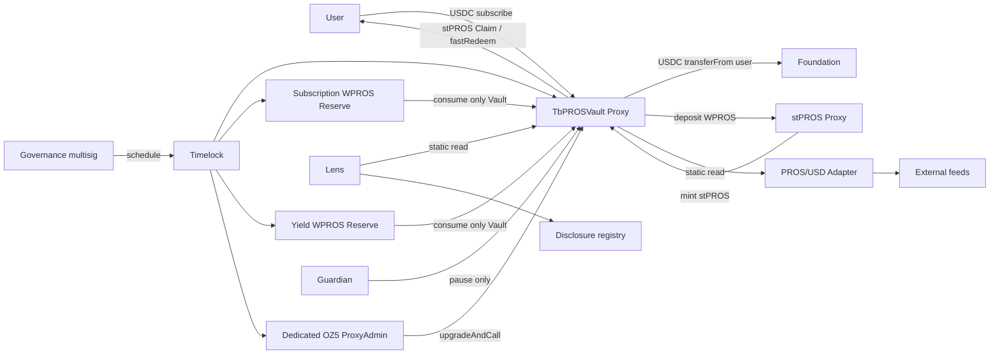

> SUPERSEDED V1 — historical audit evidence only. Current specification: [V2](../11-architecture-remediation-v2.md).

# 01 · Architecture / repository evidence

## 1. 仓库事实与上一版冲突

本轮只读取源码、依赖和配置；没有把旧测试报告当作本轮测试结果。`faroo-contracts` HEAD 为 `06bb2aa9848d37e32e63bbfb5f2119ccc38be9c7`；参考 `usd-vault` HEAD 为 `cd74ef645f4c59b94a959cf103defce544a94d24`。本仓库尚无 tbPROS Solidity。

| Evidence | 实际行为 | 对设计的约束 / 修正 |
| --- | --- | --- |
| [package.json](../../../package.json)、已安装两个 OZ package.json | `contracts` / `contracts-upgradeable` **实际均 5.6.1**；package 范围为 `^5.6.1` | frozen lockfile + 精确版本/源码 hash；不能只看 semver 范围 |
| [hardhat.config.ts](../../../hardhat.config.ts) | solc 0.8.28；production optimizer 200；未显式设 viaIR / evmVersion | tbPROS 增加一致的 Hardhat/Foundry production 配置；先用 viaIR=false、200 runs，锁定 EVM 后编译 |
| [rocketh/config.ts](../../../rocketh/config.ts) | deployer、owner 默认均 account 0 | 禁止直接复用生产账户默认值；初始化最终治理地址 |
| [deploy/stPROS.ts](../../../deploy/stPROS.ts) | `SharedAdminOpenZeppelinTransparentProxy`；asset 使用 `Mainnet.WPROS` | 不能仅切 network tag 就假定测试网资产正确 |
| `@rocketh/proxy/src/index.ts` | 上述预设从 `hardhat-deploy-v1-artifacts` 导入 proxy/admin，proxy 参数是 `admin_` | 与本地 OZ 5.6.1 proxy 的第二参数 `initialOwner` **不是同一语义**；新产品显式编译/部署 OZ 5 proxy，禁止把旧 shared admin 当作 initialOwner 传入 |
| [StPROS.sol](../../../contracts/StPROS.sol)、[VToken.sol](../../../contracts/VToken.sol) | WPROS `deposit` → unwrap → SLP 原生币 call；native `depositWithPROS` 则直接向 SLP 转原生币 | tbPROS 选 WPROS 路径；包含 SLP 间接重入；不需要 tbPROS 自己处理原生币 |
| `VToken.deposit/_deposit` | 外层 deposit 没有 nonReentrant；兑换由底层 Oracle 驱动 | tbPROS 必须自守边界；不能假设外部 stPROS 已阻断所有回调 |
| [Oracle.sol](../../../contracts/Oracle.sol) | `poolInfo` 是兑换池；owner 可设池；空池兑换可回退 1:1 | 不等于 PROS/USD feed；高 TVL 信任底层 owner/admin 和池记账，不等于真实 PROS 兑付证明 |
| `VToken` pause / ERC20 | 存赎入口受 pause；源码未在 `_update` 中暂停普通 ERC20 转账 | 源码版本的 stPROS 暂停未必阻断 tbPROS 支付 stPROS；生产 fork 才能确认 |
| [test/StPROS.t.sol](../../../test/StPROS.t.sol) 等 | forge-std Solidity tests，多数用 ERC1967Proxy harness | 存储/会计测试可复用；不能证明真实 Transparent admin 升级流程 |
| `contracts/VToken.sol` / `Oracle.sol` storage | OZ namespace 加自定义线性字段、deprecated slots | tbPROS 是新 Proxy，不继承其业务 storage；不得升级 StPROS 为 tbPROS |
| 当前仓库工具 | 未发现根 foundry.toml / 本仓库 .github CI；forge 可执行文件存在 | 设计新增 Foundry 配置和 CI，不宣称现有 CI 已覆盖 invariant |
| usd-vault RedemptionQueue / Escrow / CoreVaultStorage | delegate 执行器、Receipt、请求即 burn、独立托管与有界游标 | 借鉴游标/实收检测/Claim 隔离；不移植其业务或 delegatecall |
| 上版 NAV 数学 | mint 经截断 WAD NAV 二次计算 | 改为原始 `mulDiv(assets,S,R)`，防止截断分母导致超发 |
| 上版“无角色 Claim” / permissionless push | 未严格区分调用者与请求所有者 | 结算 permissionless；Claim 仅 controller/operator，删除无授权 push |
| 上版 fee 样本 | 正常收益 vs 含 catch-up/penalty 两种建议并存 | 本稿候选采用所有显式收益增量；经济安全问题 P0，不宣称因此防 MEV |
| 用户要求“任何增加 released 前清到期” | subscribe 也增加 R，且舍入也可能使 NAV 微升 | subscribe、fast、所有收益均执行到期 barrier；不能只拦 adjustNAV |

另核对了现有 `artifacts/build-info/solc-0_8_28-27d92adffcef10a905ddd72ad8e6757be2bf835f.output.json` 的storageLayout，并确认配对build input中的VToken/Oracle/StPROS内容与当前源码一致。VToken/StPROS线性slots0..11依次为oracle、totalCanWithdrawAmount、queuedWithdrawal、completedWithdrawal、withdrawalHead、withdrawalTail、withdrawals、maxWithdrawCount、unbondingPeriod、_tracked、slp、bridgeVault；Oracle slots0..8为poolInfo、slp、vTokenAddresses、maxUpdateAmount、updateInterval、lastUpdateAt、commissionAccount、commissionRatePpm、tokenToVToken。OZ namespace不等于这些线性slot列表的一部分，需要另验。另一个已有build input与当前源码不同，不能用作发布依据；本轮未重新编译、未核实这些artifact对应任何线上implementation。

## 2. Contract topology（计划新增，不修改已有目录）

```text
contracts/
├── StPROS.sol / VToken.sol / Oracle.sol / ...   # 已有依赖，保持独立
└── tbpros/
    ├── TbPROSVault.sol                        # 单个 Transparent Proxy 实现
    ├── TbPROSLens.sol                         # 无资金、无权调用 Vault 的只读聚合器
    ├── AttestedDisclosure.sol                 # 独立非升级披露 registry
    ├── reserve/ProsReserve.sol                # 同一代码部署两次、固定不同 purpose
    ├── oracle/ProsUsdOracleAdapter.sol        # 独立非升级价格边界
    ├── libraries/AccountingMath.sol           # internal/pure，原子记账数学
    ├── libraries/MonthMath.sol                # internal/pure，UTC 月历
    ├── libraries/NavHistory.sol               # internal，32 槽 ring，只由 Vault 写
    ├── storage/TbPROSStorage.sol              # namespace 定义，无执行器
    └── interfaces/
        ├── ITbPROSVault.sol
        ├── IProsReserve.sol
        ├── IProsUsdOracle.sol
        ├── IAttestedDisclosure.sol
        └── IAggregatorV3.sol                  # 仅候选 Chainlink-style feed ABI

编译 OZ npm artifacts：TransparentUpgradeableProxy、ProxyAdmin、TimelockController
现有 IERC20/IERC4626/IWPROS 直接 import，不复制。
```



Vault 持有全部 stPROS 三桶。**不拆 Claim custody**：本产品已在 Vault 全额持有结算资产，额外 Escrow 若仍听命于可升级 Vault，无法防恶意升级，反而引入重复账本和转账。若业务要求升级治理也不能动已锁价资产，需另立不可升级、独立验证请求的 escrow 方案，本稿不假装已经提供此属性。

## 3. 拆分决策：九个维度

| 维度 | 核心留 Vault | 真正外置 | 拒绝的拆法 |
| --- | --- | --- | --- |
| Security boundary | ERC20 supply、R/P/F、本金、epoch 和 claim 权利同一所有者 | 两储备、价格 adapter、Timelock | share mint manager 引入第二个无限 mint 权限 |
| Atomicity | 所有 mint/burn/桶迁移在同一事务 | consume/deposit 整笔 revert | 独立 accounting 合约提交两阶段记账 |
| Reentrancy | 单个写锁；内部 helper 共用 | Lens 不回写 | 互相回调的 router/withdraw module |
| Accounting consistency | 只有 Vault 能写核心状态 | Reserve 只写自身消费授权，不镜像本金 | 把 pending 负债在 escrow 再存一次 |
| External call count | 结算 0 外部调用；Claim 只 token 读写 | 仅业务必要 reserve、price、stPROS | 收益 distributor 再回调主 Vault |
| Audit complexity | 矩阵列出每个 mutation | 独立模块可单独审计 | Diamond/selectors/共享 delegate storage |
| Bytecode | 原子写路径必须保留 | Lens、disclosure 真正移出 | inheritance “拆小文件”不减 runtime |
| Gas | epoch O(1)，Claim 直达或 head O(1)，历史上限32 | APY/用户全列表链下 | 遍历全部 epoch/controller |
| Upgrade / operations | 仅核心可升级；单个 dedicated admin | oracle 替换地址、lens/disclosure 重新部署 | 一次升级五个协作执行器 |

A：核心会计/供给/权限校验保留 Vault。B：纯数学、日期、ring 操作 internal libraries，**会内联计入 Vault runtime**。C：独立资产/价格/治理边界和只读 UI 才外置。D：历史 NAV 全序列、APY 拆解、储备预测、交易重试、用户请求日志仅 indexer/keeper；不把任意历史写进数组。

## 4. OZ 使用矩阵（以本地 5.6.1 源码为准）

| Requirement | OZ component | Use | 原因 / 实际 API |
| --- | --- | --- | --- |
| share | ERC20Upgradeable | Yes | `__ERC20_init`、`_mint/_burn/_update`；禁用外部 burn/mint；18 decimals |
| ERC4626 | IERC4626 ABI；不继承 ERC4626Upgradeable 默认数学 | Interface subset | 默认 `(S+1)/(R+1)` 虚拟资产语义与本产品精确双本金/epoch 不符；标准边界见05 |
| token transfer | SafeERC20 | Yes | `safeTransfer/safeTransferFrom/forceApprove`；后者不能替代余额差额校验 |
| arithmetic | Math.mulDiv / SafeCast | Yes | `Math.Rounding.Floor/Ceil`，uint64 转换不得直接截断 |
| operational roles | AccessControlUpgradeable | Yes | DEFAULT_ADMIN=Timelock；只给 guardian/NAV 有限角色 |
| default admin rules | AccessControlDefaultAdminRulesUpgradeable | No | 已有 Timelock 控制 grant/revoke/admin迁移；第二层 delay 增加恢复协调，无独立 root 保护；接收额外剩余治理风险 |
| governance | TimelockController | Yes | ctor(minDelay,proposers,executors,admin=0)；schedule/execute/cancel/updateDelay；self-admin |
| pause | PausableUpgradeable | Yes + 一个 requestsPaused bool | OZ `paused` 统一风险操作暂停；额外 bool 独立暂停新请求。无 claimPaused / settlePaused；不自写多角色 pause 框架 |
| reentrancy | ReentrancyGuard (storage based) | Yes | 本地有固定 namespace 和 `nonReentrantView`；proxy 初始槽0不是 ENTERED，首次调用可用且结束写1，必须测试；无虚构 `__ReentrancyGuard_init` |
| transient guard | ReentrancyGuardTransient | No for new Vault | 减少目标链假设；底层 stPROS 仍依赖 Cancun，fork必须验证 |
| UUPS | UUPSUpgradeable | No | 本地 upgradeable 路径重导出普通 UUPS；不混入 Transparent implementation |
| proxy/admin | OZ5 TransparentUpgradeableProxy / ProxyAdmin | Yes | 新 proxy ctor 自动创建独立 ProxyAdmin(initialOwner)；admin API `upgradeAndCall`，版本 `5.0.0` |
| initialization | Initializable | Yes | implementation ctor `_disableInitializers()`；proxy ctor 带初始化 calldata |
| history | Checkpoints | No | 本地 Trace 系列是增长数组；此处需要32槽上限、day tag、generation；自定义 ring 的数学/索引重点差分测 |
| reserve/disclosure owner | Ownable | Yes | constructor owner=Timelock；只预定地址支出，不增加 EOA 管理员 |

自定义仅有协议会计、日期、ring、请求 operator mapping（标准要求、无签名 crypto）和第二个 pause bool。没有自写 proxy/timelock/token转账/通用 ACL/重入锁。MonthMath 需选固定版本的已使用过的 Gregorian 算法并逐式审核及差分，不凭空“知道这个库安全”。

## 5. ADR-01 升级架构

**Decision / final choice**：新 tbPROS 用显式本地 OZ5 Transparent Proxy + 自建于构造器的 dedicated ProxyAdmin，owner=Timelock；Reserve/Oracle/Lens/Disclosure 非升级。保留现有项目的 Transparent 模式，明确改变新产品 artifact 来源；不触碰旧产品 proxy。

| Alternative | Advantages | Risks / 为什么未选 |
| --- | --- | --- |
| UUPS | Proxy 小、无需独立 admin 合约 | 实现包含升级授权；误删或误改授权可接管/永久锁死；与现有部署习惯不同 |
| Transparent | admin 边界清晰、适合现有运维 | 多一个 admin 合约；混用 OZ4/OZ5 构造参数可锁死；需要单独验证 |
| Non-upgradeable Vault | 无升级窃取权 | 核心出错只能迁移，活跃月度债权迁移复杂；不满足当前可维护目标 |

**Storage implications**：新 `erc7201:faroo.storage.TbPROSVault` namespace，合约内无其他业务线性字段；ERC20/ACL/Pausable/guard 用各自 OZ namespace。每个 mapping value/struct 只追加，不能改字段类型、重排、复用删字段。统一 namespace 定义不是 delegate executor。namespace slot 用 ERC-7201 公式生成、存档并校验与 OZ及ERC1967槽不碰撞；不手写猜 hash。不同时添加无意义的 storage gap。namespaced storage并不自动证明升级兼容。

**Governance implications**：implementation无 UUPS 升级入口；调用链仅 Timelock→ProxyAdmin→proxy。DEFAULT_ADMIN 持有人与 ProxyAdmin owner 分开核对。Timelock 自身可延迟授权新 root，也可延迟降 delay；OZ原版没有不可变的48小时地板，不声称有。治理恶意升级可改变所有约束，包括 Claim；这是不可移除的 root trust。

**Audit implications**：审查 proxy、admin、implementation、所有 initializer、namespace schema、治理 payload，禁止只审 implementation。ProxyAdmin 不能调用普通 Vault fallback，而 Timelock（owner、非proxy admin本身）可以。

**Recovery**：小版本回退只有在新版本未做不可逆布局/语义迁移且旧版本能解释当前状态时才可执行；保留旧 bytecode 不等于可回退。优先 forward fix，风险路径暂停，健康账本 Claim仍运行；fork重放升级前后请求/claim/余额/角色。迁移需同笔 upgradeAndCall + reinitializer；无无限扫历史的迁移。详情08。

## 6. Bytecode / gas budgets

以下是**设计估算区间，未编译 tbPROS，不能当作测量结果**；实际超预算即重新评审。

| Deployable | Runtime estimate | Merge budget bytes | Initcode budget含args | 热点 |
| --- | ---: | ---: | ---: | --- |
| TbPROSVault implementation | 17–23 KiB（有超预算风险） | 20,480 | 40,960 | ERC20/ACL、结算、Claim、32槽跨日更新；保留至少4096 bytes距离EIP170上限 |
| ProsReserve ×2 | 每个2–4 KiB | 5,120 | 10,240 | allowance写、consume转账 |
| ProsUsdOracleAdapter | 2–5 KiB | 6,144 | 12,288 | feed staticcalls /异常检查 |
| TbPROSLens | 3–6 KiB | 8,192 | 16,384 | 最多32历史槽/24分页项只读 |
| AttestedDisclosure | 2–4 KiB | 5,120 | 10,240 | 单key最新值替换 |
| TimelockController | 6–10 KiB | 12,288 | 24,576 | schedule/execute batches；operation storage增长 |
| OZ5 Transparent proxy | 0.7–1.5 KiB | 2,048 | 12,288 | 初始化+内建ProxyAdmin创建 |
| OZ5 ProxyAdmin | 0.8–2 KiB | 3,072 | 6,144 | 仅升级调用；由proxy部署 |
| internal libs/interfaces/storage schema | 无独立 runtime | 计入使用者 | — | 分文件不节约核心代码 |

共用 solc 0.8.28、optimizer200、候选 evmVersion=cancun（因整个集成已有此依赖）、viaIR=false。比较 viaIR=true 必须重测差分/审计且配置完全锁定。不得使用 unlimited contract size、提高链上 size limit 或任意调 runs 避开 gate。[EIP-170](https://eips.ethereum.org/EIPS/eip-170) runtime上限24,576 bytes；[EIP-3860](https://eips.ethereum.org/EIPS/eip-3860) initcode上限49,152 bytes，目标 Pharos 的激活/限制必须实测。

候选 gas 回归预算：subscribe 800k；fast 300k；request 250k；单epoch settle 350k；claim 300k；NAV 900k；lazy ring 首次跨32天额外2.5m。均非测量值，单笔 worst-case <=目标块gas的20%，自动结算最多4个、独立最多12个；主网fork后收紧。gas报告按冷槽/新用户/部分Claim/跨32天/12节点分开。

若核心超20KiB：先移除非核心 paginated views到Lens、移除 on-chain APY、合并冗余ABI（经集成评审）；随后测 ring/date/math 的实际占比。仍超标则停止进入实现下一阶段，评审真实独立赎回 custody/state 边界并重做矩阵；不偷偷引入外部 library delegatecall。CI gate见07。
