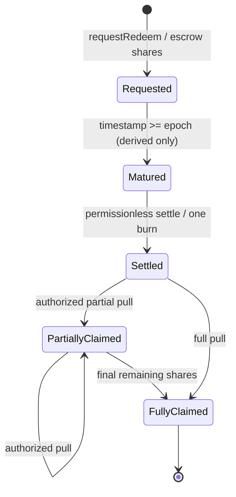

> SUPERSEDED V1 — historical audit evidence only. Current specification: [V2](../11-architecture-remediation-v2.md).

# 05 · Epoch / redemption / pricing state machine

## 1. Calendar and state

epoch id就是严格下一自然月1日00:00 UTC时间戳，非发行轮次。MonthMath(year,month,day)须覆盖Gregorian闰年 `y%4==0 && (y%100!=0 || y%400==0)`，December rollover，1970–9999；不从固定30天累加。等于月初时也进入下一月。L1 timestamp/排序属共识信任，不承诺交易广播时所属月份。



Requested/Matured同一个pending存储态，时间经过不写state。Settled是epoch级，Partially/FullyClaimed是position级；某用户全领不能推导整个epoch全领。settled flag优先于当前timestamp，链重组由确认策略处理。

| Transition | Caller | Storage mutation | Forbidden |
| --- | --- | --- | --- |
| none→Requested | owner / authorized caller | _transfer owner→V；position/epoch shares增；新节点append | burn、预先记录用户assets、当前月插入 |
| Requested→Matured | 时间派生 | 无 | keeper手工调整dueAt |
| Matured→Settled | anyone | 固定num/den；R→P；burn escrow、U/B核销；pop | 未到期、重复settle、按用户循环 |
| Settled→Partial/Full | controller/operator | claimedShares/Assets增、P减、转stPROS | 再burn、oracle刷新、修改原share总额 |
| Partial→Full | 同上 | 取剩余shares；unlink position；epoch全领才处理dust | 改receiver为未授权第三方 |
| 已settled→Requested / 已full→partial | 无 | 无 | 所有逆向转换无入口 |

## 2. Requests / bounded queues

每个非空epoch一个global未settle节点；request的时间戳单调，append只会在尾部。head/tail通过O(1)维护，无逐月扫空节点。每controller维护按请求时间排序的position双向链；同epoch合并，不生成无限逐笔request数组。controller上限24，仅拒绝新增第25个position；显式Claim永远可用。外部索引器利用RedeemRequest事件恢复每笔原始申请。

授权：owner==caller可请求；否则owner批准caller为operator则不花ERC20 allowance；否则 `_spendAllowance(owner,caller,q)`。若controller!=owner，额外要求caller==controller或caller为controller的operator，防止拥有share allowance的第三方将别人资产送到自己控制的请求（能使用ERC20 allowance本身已很强，双重检查减少误用）。controller/owner非零、非V；将receiver限制只在实际claim时按controller授权。

**Audit correction**：上述双重检查仍允许被owner批准的spender指定自己为controller，这等价于其已有token支出权，并非新增不可盗属性。UX明确ERC20无限approval与operator均可转移权益；推荐精确allowance。若要只允许controller=owner，可做额外产品限制但须重新评审标准兼容。

直接`transfer/transferFrom(...,V,...)` shares拒绝，正常request走内部 `_transfer`，防不记账的share捐赠。无取消、无request转让、无快赎pending shares；fast只处理用户钱包现有shares。

## 3. Settlement pseudocode

```text
settleMaturedEpochs(maxEpochs):
  nonReentrant; require 1 <= maxEpochs <= 12
  freeze A0=R, S0=S, tail0=epochTail
  while processed < maxEpochs AND head != 0 AND head <= now:
    e=head; assert !e.settled AND 0 < e.nodeShares <= S
    q=e.nodeShares; snapshot S,U,B
    a=(q==S ? R : mulDiv(q,A0,S0,Floor))
    du,db = burnPrincipal(snapshot,q)
    e.num=A0; e.den=S0; e.lockedAssets=a; e.settled=true
    R-=a; P+=a; U-=du; B-=db; _burn(V,q)
    pop head; emit EpochSettled(...)
    if e==tail0: break
  if S==0: assert R==U==B==0; deactivate history generation
```

本入口完全不调用stPROS、美元oracle、reserve或NAV服务。S0=0且head存在为broken invariant，不可默默跳过；正常情况无节点时返回0。一次snapshot供同交易多个节点共用，同节点所有用户同价。由于每次操作有锁，tail0实际不能被回调修改，但仍从本地状态固定，不让caller输入。

`_settleBeforePricing()`只在外层持有同一个锁时内部调用，不调用external settle造成嵌套锁；最多4个后若仍有成熟节点则revert EpochBacklog，前4个也回滚。运营独立入口每次提交保存前缀。失败的NAV交易不能持久化它内部先执行的settle，这是EVM原子性；想保障推进须另发settle交易。

barrier位于subscribe、fast、normal、catchup、penalty任何核心定价之前。`previewFastRedeem`虚拟执行相同最多4节点burn/principal路径（只需相关R/S局部变量），如仍backlog同样报不可执行；不得简单用未settle状态报价。禁止为预览执行token/Oracle收益入账。

## 4. Claim and zero supply

`redeem(q,receiver,c)`直接读取positionHead[c]；若head尚未settled返回NotClaimable，不能扫几百旧节点。因为month顺序和settle前缀一致，head未settled意味着后续也未settled。`claimRedeem(e,q,receiver,c)`可O(1)跳到已settled任意position，full后O(1)从双向链删除；同时维护head/tail/count，不留下无限tombstone扫描。

收款人由controller或其operator指定，禁止receiver=V/零地址；不消费当前ERC20余额/allowance，不再burn。Claim先校验全部账本backing L>=Σ，再按03累计差额写claimed与P，最后safeTransfer并核对真实支付差额；若token付款失败，全部进度回滚。无价格/储备/keeper/暂停校验。健康真实资产是必要条件；不是对账本亏空的无条件先到先得提款承诺。

epoch最后全部shares已领，剩余数学dust从P转F；不依赖活跃S，允许S=0。新池1:1只分享新R，旧P/F仍归原来的类别；所有老epoch price和position跨generation保留。长期无人Claim没有超时没收/强制转出。

## 5. Fast history algorithm（bounded，候选经济口径）

维护 `Z`=本generation所有显式收益的累计每share增量ray（1e27）。normal/catchup的a、penalty的navAmount在收益写入前S不变，`Z += floor(a*1e27/S)`。不计subscribe/settlement/fast的整数舍入上升；不计donation直接余额。包含catchup和penalty是本稿单一候选口径，替代旧稿的两种建议，仍需P0-ECON接受。

`ring[day % 32]={day,generation,Z_end}`；当前UTC日条目可以重复更新到当日最后Z。每次收入前lazy advance：补缺日以前一个Z carry-forward；间隔<=32最多写32槽，间隔>32只初始化最近32天为旧Z，不迭代缺失的所有天。每slot必须校验day和generation。view报价在内存模拟同一推进，不写状态。

generation首次subscribe记录startTime。`firstFullDay = ceil(startTime/86400)`（恰好午夜取该日）；现在D=floor(now/86400)，完整观察天数 `n=min(30,max(0,D-firstFullDay))`。n=0拒绝快赎。`avgDeltaRay=floor((Z_end[D-1]-Z_end[D-1-n])/n)`；同日多次收益只影响当日日末，不能使用未完成日数据。不存在收益的完整日增量为0，不跳过它。历史旧于ring由事件索引器提供，链上不支持任意年化查询。

daysToNext=ceil((strictNextMonth-now)/86400)，范围1..31；恰到月初重新按下个月，不能返回0。fee=ceil(q*avgDeltaRay*days/1e27)，net=gross-fee；fee>=gross失败，不自动clamp减少收费，preview显示不可执行原因。双方Math路径完全共享；余额、pause和用户份额不足属于执行限制，由Lens单列，不把quote可算等同成功。

**明确剩余风险**：n>=1但avg=0合法，会产生0 fee；新本金恰在NAV注资前进场又在月末快退，可能捕获不匹配的1日收益。更改fee样本、冷启动或vesting会改变产品经济规则，不能靠以上算法证明消除。详见06攻击例和10 P0。

## 6. Standards profile ADR

[ERC-7540](https://eips.ethereum.org/EIPS/eip-7540) 要求异步redeem previews revert、Claim pull、controller/operator身份及完整相关ERC4626流程。实现只按epoch保管待赎shares可以符合其请求思路；“自动到账”只能来自用户已授权operator另发Claim，不能permissionless推送。旧稿无授权固定controller push建议撤销。

候选V1采用ERC20 + 自定义USDC订阅 + ERC7540-shaped request/claim + redeem-only提现。`withdraw`暂明确Unsupported，不宣称完整ERC7540 interface id；`deposit/mint`禁用而max为0。用户若要求完整标准，应在编码前选择另一个profile，明确精确资产withdraw以及剩余可领碎片账本，而不是给withdraw一个返回近似值的实现。仅开放redeem是不完整标准的产品选择，不能称为通过测试后自动合规。

previewClaim必须显式controller、epoch、shares；previewRedeem/previewWithdraw统一revert；convertToAssets描述**活跃份额**当前价值，不是固定请求领款值。这个差异必须体现在ABI文档、钱包模拟和前端按钮。
