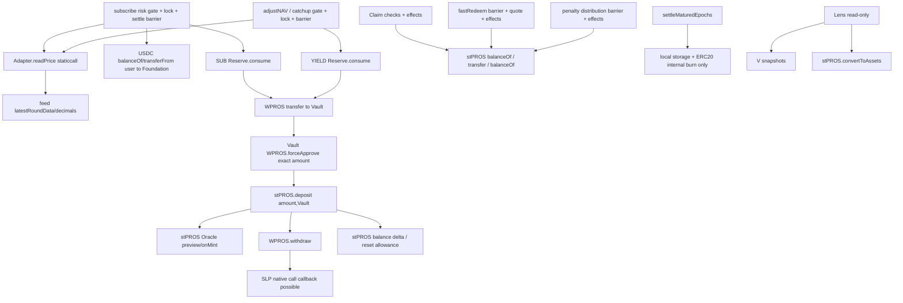

> SUPERSEDED V1 — historical audit evidence only. Current specification: [V2](../11-architecture-remediation-v2.md).

# 06 · Threat model / external calls / Oracle

## 1. Scope and trust

Threat actors：普通用户、持有无限allowance的spender、恶意receiver、任意keeper、被盗NAV key、被盗guardian、恶意Foundation、单/双oracle失陷、stPROS/WPROS/USDC管理员、升级治理。对公开交易的front-run/back-run、时间边界、长期不操作、重组、极小本金均建模。

“Existing mitigation”仅表示本地已读取OZ/底层具备该机制，不代表未实现的tbPROS已有防护。高TVL余额最终仍依赖底层stPROS的SLP/Oracle/ProxyAdmin以及可升级Vault的TL。stPROS `convertToAssets` 是记账汇率，不证明RWA/SLP储备真实；tbPROS给的是stPROS债权，不保证USDC退出价格。

## 2. External Call Graph

| Call | Trust / callback / failure | Validation / atomicity / support |
| --- | --- | --- |
| USDC.balanceOf(user/Foundation) | token升级可返回假值/revert/staticcall回调view | before/after用户扣款与Foundation实收必须各等于u；不支持FOT/rebasing |
| USDC.safeTransferFrom(user,Foundation,u) | SafeERC20检查false/无return，不证明经济行为；可回调 | 用户精确授权；固定Foundation；失败连同前序settle回滚 |
| Reserve.consume(p) | immutable reserve代码；caller=V；余额仍取决WPROS | 先预算-p再transferV；无任意to；对V WPROS实收差额p核验 |
| WPROS.balanceOf/forceApprove | 假return、恶意approve callback、blacklist | 仅已绑定stPROS spender，逐笔p→deposit→0；无无限授权和通用execute |
| stPROS.balanceOf/asset/decimals/previewDeposit | 可升级依赖；view也能回调读取 | 初始化核验身份；mint预期+实收双检查；不能仅信reported return |
| stPROS.deposit(p,V) | **可进入SLP原生币外部call**；paused/Oracle/SLP可revert | 比较return与actual positive delta，WPROS消费p；接受只有符合已批准底层ABI/会计的结果 |
| SLP.call(native) [间接] | unknown receiver执行任意代码 | Vault已持锁；正常token操作/配置也阻断写重入；测试由SLP回调每个Vault入口 |
| Adapter.readPrice | immutable代码但可被TL替换；staticcall可revert/耗gas | 无自动使用cache；Risk fail-closed；查询显示error，不影响Claim |
| feed.latestRoundData/decimals | oracle可失真/过时/超大return | adapter验证完整性/边界；供应商身份验证不是接口检查能替代 |
| stPROS.safeTransfer(receiver,a) | token可能fee/rebase/冻结receiver或V/恶意升级 | 先effects，前后V减a、receiver加a；zero payout可不call；失败全回滚 |
| stPROS.convertToAssets | rate oracle异常/返回不可信 | 只Lens展示及必要收益mint预检；settle/Claim/fast定价绝不能读此函数 |
| TL.execute / ProxyAdmin.upgradeAndCall | root trusted arbitrary target，升级可摧毁全部语义 | 精确payload hash、delay、fork replay、monitor；不是nonReentrant能防的风险 |

标准USDC/WPROS/stPROS profile均**不支持fee-on-transfer、rebasing、ERC777语义或可变decimals**。恶意token仍可伪造balanceOf骗过差额，故差额检查不是对任意token的安全证明。权限/资产绑定拒绝用户输入替换token。任何关键外部调用失败传播revert，只有Lens信息查询可局部try/catch。

结算无外部call。正常Claim约含3–4个balance读与1个转账（含receiver差额检测）；多调用开销换取实付验证，fork gas测后才考虑优化。subscribe读取价格一次，不重复请求同一feed来“增加安全性”。

## 3. Reentrancy Attack Paths / CEI

**Claim / fast / penalty**：检查权利、真实backing、限额及冻结的quote→完整更新P/F/R、claim进度、supply与本金→转stPROS→核对差额。不把external call放在两本金写入之间。失败全部回滚。

**Subscribe / NAV**：最终shares和收益比例依赖实际mint结果，无法在stPROS.deposit前伪写最终会计。采用检查/冻结快照→受保护的pull/mint→根据差额一次commit；交互期间维持旧的已提交账本，不提前发事件或mint用户shares。入口锁在任何外部调用之前；回调试图进入request/claim/settle/fast/subscribe/收益/pause/config/roles/operator/ERC20写函数全部失败。允许内部 `_mint/_burn/_transfer` 使用OZ逻辑，不通过同名external wrapper。

这不是机械CEI，而是对需要“实收才能知道输出”的受锁例外；其安全依赖I-24原子性、I-20唯一supply写者以及read-only reentrancy防护。不要在token调用之间release lock。

**Read-only reentrancy**：`accountingState`、NAV/转换/预览等组合值使用本地OZ `nonReentrantView` 或统一 `_requireIdle`。内部计算不调用这些带保护的external/public wrapper，使用本地snapshot或 `super.totalSupply()`。ERC20 `balanceOf/totalSupply`作为基础公开状态可在回调中被观察，无法阻止外部读取token真实余额；不得把原始余额拼出的瞬时ratio作为第三方抵押Oracle。集成者只能使用已提交且idle的NAV接口，且不能把tbPROS作为无需独立安全审查的借贷抵押估值。测试恶意receiver/SLP调用第三方模拟借贷池，验证关键snapshot被拒绝。

**Cross-contract**：Reserve自己的lock和onlyVault阻断consume重入；V的配置setter同锁，防被授权恶意外部地址在一笔mint里换Oracle/recipient。TL升级没有调用Vault的nonReentrant guard，因此强治理若与恶意依赖串谋可能mid-call升级；治理operation固定payload与fork审查是其边界，不能声称所有root行为受Vault锁保护。

## 4. PROS/USD Oracle Threat Model

候选adapter支持Chainlink-style `latestRoundData()` ABI，**尚未找到并验证目标链真实PROS/USD feed**。供应商若是Pyth等，应先改adapter接口再编码，不能假装同一接口。参考[供应商API说明](https://docs.chain.link/data-feeds/api-reference)；`answeredInRound`在现代feed中可能已废弃，完整性校验必须服从所选feed语义，不把旧字段当通用新鲜度证明。

1. 初始化保存并校验feed decimals；read若feed实现可升级，确认当前decimals仍等于配置，否则revert。支持0..18；`priceE18=answer*10^(18-feedDecimals)`，answer先要求>0，再检查上界和整数乘法。
2. 必须 `updatedAt>0 && updatedAt<=now && now-updatedAt<=maxAge`；lastUpdate=0/未来时间不接受。roundId必须有效；采用需要answeredInRound语义的feed时要求answeredInRound>=roundId；拒绝异常ABI/返回长度。
3. 绝对price floor/ceiling是源单位下正常PROS市场范围，不锚1USD。guardrails只保护极端错误，不能检测范围内合谋价格。
4. 如启用第二独立源，两者均新鲜、单位相同，`ceil(abs(P1-P2)*10000/min(P1,P2))<=maxSpreadBps`，否则**两者都不选**。价格取固定primary，不让caller选更有利源。
5. 默认无自动fallback；primary失效即停止subscribe/NAV，Claim/settle/fast无需美元price。治理暂停风险路径、核实数据后部署备用adapter，经TL切换；不能因primary故障降级到陈旧缓存或任意管理员价格。
6. fallback准备：发布备用供应商地址、decimal/heartbeat/independence证据和已演练payload；若业务要求故障即自动切换，是另一个需审计的策略，不藏在try/catch。
7. 本稿**不存lastAcceptedPrice来做可被逐笔爬坡绕过的偏差阈值**；偏差定义为同时有效两源价差+绝对范围。单源部署时只有范围/新鲜度，不能宣传有独立操纵检测。
8. stale/front-running：fresh并不等于实时可成交。USDC→PROS数量根据成交时price，不基于请求时前端quote；minSharesOut限制用户不利成交，不能保护Foundation免被陈旧偏低PROS价抽干reserve。需fork+历史序列模拟feed lag和MEV损失，设置可承担cap及频率；P0-ORACLE阻断生产。
9. USDC被当USD1:1是产品假设；若USDC脱锚用户可用折价USDC换PROS储备。不能在文档里把美元feed等同USDC/USD验证。需明确接受此敞口或另立USDC/USD guard，后者增加外部依赖和产品范围。

| Needs PROS/USD | Never reads PROS/USD/feed/reserve |
| --- | --- |
| subscribe、正常NAV、adminCatchUp；Lens订阅报价 | request、settle、Claim、fast数学、penalty分配、本地NAV、max/pending/claimable |

## 5. Economic counterexamples（必须解决/接受的P0）

`5%/365`按**触发时本金**发一天收益、成功间隔20h，连续20h触发的年频率约438次，实际该规则可达约6%简单年收益而非自然年5%。NAV角色仅限制谁执行，不改变这个数学事实。运营24h约束只能是SOP，不是链上收益上限。

另一序列：已有history且过去完整日增量为0，month-end用户在normal调整前subscribe，新U立即贡献整日yield；同交易组/后一区块adjustNAV后快退，fee历史不含今天所以可能为0。即便均值非0，月末days=1与首次/补算大额跳变仍可能不足覆盖捕获收益。catchup每笔<=1%但多笔可以累计任意大；penalty 100%NAV又不受这两条上限，单笔配置检查不能防总体操纵。

本稿不偷偷添加锁仓、时间加权本金、vesting或累计补算限额；这些是可供产品选择的修复方向。需模型测量资本规模、Oracle变化、交易排序、收益注入、全池退出，确定保留现有规则并披露/控规模，还是修改规则。**在该决策前，不能称经济模型适合高TVL。**

## 6. Audit risk register

| Risk | Attack path | Impact | Existing mitigation | Additional mitigation（本稿要求） | Test / control |
| --- | --- | --- | --- | --- | --- |
| 01 Reentrancy | SLP/token回调Claim/role/transfer | 盗资/坏账 | OZ5 guard可用 | 所有相关写入口同锁+view边界 | Reentrancy.t.sol / M-11 |
| 02 Access control | share allowance转controller/冒充operator | 请求权被拿走 | OZ ACL/ERC20 | 双授权语义，Claim独立operator | Authorization.t.sol / M-09 |
| 03 Upgrade takeover | proxy裸initialize/EOAadmin | 全TVL失窃 | OZ Initializable/Transparent | ctor calldata，TL admin，专属artifact | ProxySecurity.t.sol / M-10 |
| 04 Oracle manipulation | 偏低PROS/USD增加prosDue | 抽干储备 | 现有Oracle不是USD保护 | 独立源/范围/cap，供应商评审 | OracleManipulation.t.sol / M-02 |
| 05 Stale oracle | 已过期/未来updatedAt | 错价 | 无tbPROS实现 | freshness fail closed，不用缓存 | OracleValidity.t.sol / M-02 |
| 06 Donation | 给V转stPROS改变余额 | NAV/DoS | ERC20可直接转 | 显式账本+surplus | Donations.t.sol / M-01 |
| 07 Inflation | 低S＋治理注资提高单位share价值 | 后续mint极少shares | OZ默认virtual非本语义 | 精确ratio、minOut、低S经济fuzz | Inflation.t.sol / M-07 |
| 08 Rounding extraction | 反复拆Claim/subscribe/settle | 漏损 | Math.mulDiv | 累计claim差额、有理数锁价 | ClaimFragmentation.t.sol / M-06 |
| 09 Precision loss | 6/18/price精度混算 | 极大错价 | SafeCast/Math | profile拒绝错decimals | Precision.t.sol / M-02 |
| 10 First/last | supply0但R/P/F残留 | 新用户拿旧收益 | 无 | full burn清R/U/B；代次隔离 | EmptyPool.t.sol / M-01 |
| 11 Dust | 最后一人获得全局rounding | 不公平/锁仓 | 无 | 最终P→F固定归属，任何人不拿bonus | Dust.t.sol / M-06 |
| 12 Double claim | 同position并发operator交易 | 二次支付 | EVM原子性 | claimedShares先写 | Claim.t.sol / M-06 |
| 13 Double settlement | 重复同epoch/游标跳回 | 二次burn | 无 | settled单向+pop同笔 | Settlement.t.sol / M-05 |
| 14 Epoch griefing | 1wei大量用户/历史节点 | gasDoS | usd有界队列可借鉴 | 每epoch O(1)，非空节点 | QueueGas.t.sol / M-05 |
| 15 Unbounded loop | 扫所有用户/空月/history | 永久锁退出 | 无tbPROS实现 | 12/4/24/32硬界 | LongHistory.t.sol / M-05 |
| 16 Storage collision | 升级改mapping struct/namespace | 债权损坏 | OZ namespaces | schema diff＋proxy真实升级 | Storage.t.sol / M-10 |
| 17 Timestamp | 边界block交易抢节点 | 多拿一个月收益 | 共识timestamp | strict next month，成熟先barrier | Boundaries.t.sol / M-05 |
| 18 Leap year | 2100错判/30天月份 | 错误结算日 | 无 | Gregorian reference差分 | Calendar.t.sol / M-05 |
| 19 Front-running | 收益前入场捕获1日yield | incumbent/储备被稀释 | minOut只保护用户价格 | P0-ECON定量模型/产品修正 | EconomicSequences.t.sol / M-07 |
| 20 MEV | 月末低fee快退/排序price update | 提取补贴 | 无完整保护 | 同上，不能靠keeper保密 | EconomicSequences.t.sol / M-08 |
| 21 Allowance abuse | 常驻stPROS无限WPROS授权 | 外部升级扫款 | SafeERC20可用 | 精确逐笔approve→0；储备自有预算 | Allowance.t.sol / M-03 |
| 22 Reserve drain | consume任意spender/to/跨用途 | 未使用本金储备丢失 | 无 | immutable purpose、fixed V、预算 | Reserve.t.sol / M-03 |
| 23 Pause freeze | 通用whenNotPaused在Claim上 | 正常退出锁死 | 底层pause模式不适合照搬 | 无Claim pause；健康资产可付 | PauseExit.t.sol / M-09 |
| 24 Governance abuse | TL到期恶意升级/receiver修改 | 全TVL损失 | TL延迟仅预警 | 多签签名安全、Guardian风险暂停，公开root假设 | Governance.t.sol / M-09/10 |
| 25 Catchup manipulation | 多笔1%复合/错币种上限 | 收益/fee操纵 | 单笔限制未足够 | TL＋P0经济累计限制决策 | CatchUp.t.sol / M-07 |
| 26 Penalty manipulation | 一次大分配抬fee/history | 用户快退成本陡增 | bps配置不防经济异常 | TL配置/执行、历史披露、P0模型 | Penalty.t.sol / M-08 |
| 27 Abnormal token | blacklist/rebase/假balance | 冻结/超付 | SafeERC20只处理调用结果 | profile身份、差额、upstream监控 | AdversarialTokens.t.sol / M-11 |
| 28 Unexpected transfers | 直接USDC/WPROS/share/stPROS | 不记账资产或DoS | ERC20不能拒绝stPROS转入 | shares外部拒收；stPROSsurplus；无泛用sweep | Donations.t.sol / M-01 |
| 29 DoS | gas grief /过长TL批次 /Oraclerevert | 服务停顿 | 用户pull Claim | 独立settle、单positionclaim、boundedretry | FailureIsolation.t.sol / M-05/11 |
| 30 Cross-function corruption | subscribe/claim/penalty交错、重入setter | 双本金/桶错位 | 无tbPROS实现 | 单writer、同锁、完整矩阵 | ProtocolInvariant.t.sol / M-01 |

static检查、fuzz或OZ组件使用均不能单独证明以上风险消失；07定义测试及release gate，09定义故障时可操作的边界，10保留审计反对意见。
